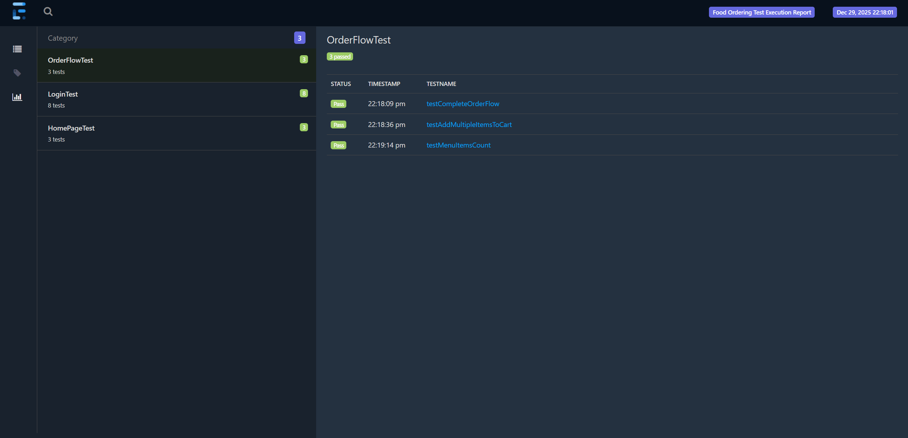
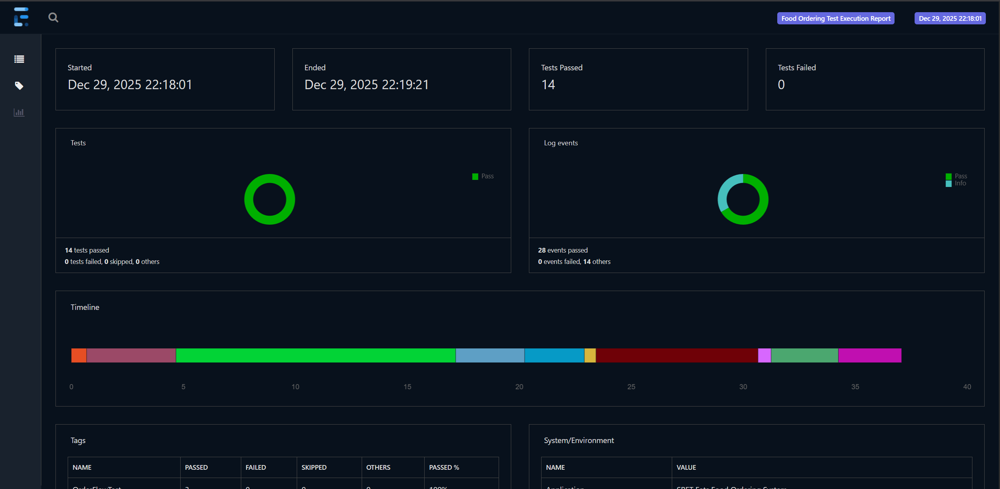
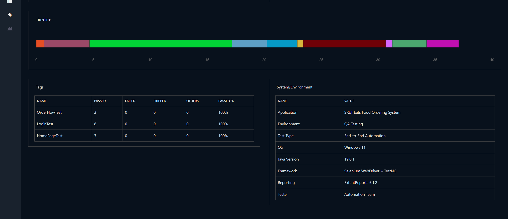

# 🍔 SRET Eats - Food Ordering System Test Automation


Comprehensive automation testing framework for SRET Eats food ordering application using Selenium WebDriver, TestNG, and Page Object Model design pattern.

---

## 📋 Table of Contents
- [Project Overview](#project-overview)
- [Features](#features)
- [Tech Stack](#tech-stack)
- [Project Structure](#project-structure)
- [Prerequisites](#prerequisites)
- [Installation & Setup](#installation--setup)
- [Running Tests](#running-tests)
- [Test Reports](#test-reports)
- [Test Scenarios](#test-scenarios)
- [Configuration](#configuration)
- [Contributors](#contributors)

---

## 🎯 Project Overview

This project provides end-to-end automated testing for a food ordering web application built with React. It validates critical user flows including:
- User authentication (login/logout)
- Menu browsing and item selection
- Shopping cart operations
- Order placement and tracking

The framework follows industry best practices with Page Object Model (POM) architecture, data-driven testing capabilities, and comprehensive HTML reporting.

---

## ✨ Features

- ✅ **Page Object Model (POM)** - Maintainable and reusable page classes
- ✅ **Cross-Browser Testing** - Chrome, Firefox, Edge support
- ✅ **Parallel Execution** - Run tests simultaneously on multiple browsers
- ✅ **ExtentReports Integration** - Beautiful HTML test reports with screenshots
- ✅ **Screenshot on Failure** - Automatic screenshot capture for failed tests
- ✅ **Configuration Management** - Centralized config.properties file
- ✅ **WebDriverManager** - Automatic driver management
- ✅ **Maven Build Tool** - Easy dependency management
- ✅ **TestNG Framework** - Powerful test execution and reporting

---

## 🛠️ Tech Stack

| Technology | Version | Purpose |
|------------|---------|---------|
| Java | 11+ | Programming Language |
| Selenium WebDriver | 4.27.0 | Browser Automation |
| TestNG | 7.10.2 | Test Framework |
| Maven | 3.x | Build & Dependency Management |
| ExtentReports | 5.1.2 | HTML Reporting |
| WebDriverManager | 5.9.2 | Automatic Driver Management |

---

## 📁 Project Structure

```
sret-eats-selenium-automation/
│
├── src/
│ ├── main/java/
│ │ ├── config/
│ │ │ └── ConfigReader.java # Configuration file reader
│ │ ├── pages/
│ │ │ ├── BasePage.java # Base page with common methods
│ │ │ ├── LoginPage.java # Login page objects
│ │ │ ├── HomePage.java # Home page objects
│ │ │ ├── MenuPage.java # Menu/Snacks page objects
│ │ │ ├── CartPage.java # Shopping cart page objects
│ │ │ └── OrdersPage.java # Orders page objects
│ │ └── utils/
│ │ ├── DriverFactory.java # WebDriver initialization
│ │ ├── ExtentReportManager.java # Report configuration
│ │ └── ScreenshotUtil.java # Screenshot utilities
│ │
│ └── test/java/
│ ├── base/
│ │ ├── BaseTest.java # Base test setup/teardown
│ │ └── ExtentTestListener.java # TestNG listener for reporting
│ └── tests/
│ ├── LoginTest.java # Login functionality tests
│ ├── HomePageTest.java # Home page tests
│ └── OrderFlowTest.java # End-to-end order flow tests
│
├── src/test/resources/
│ ├── config.properties # Test configuration
│ ├── testng.xml # Sequential test execution
│ └── testng-parallel.xml # Parallel test execution
│
├── test-output/ # Test reports (auto-generated)
├── screenshots/ # Failed test screenshots
├── pom.xml # Maven dependencies
└── README.md # This file

```


---

## 📋 Prerequisites

Before running the tests, ensure you have:

- ✅ **Java JDK 11 or higher** installed
- ✅ **Maven 3.6+** installed
- ✅ **Git** installed
- ✅ **Chrome browser** (latest version)
- ✅ **Edge browser** (optional, for parallel testing)
- ✅ **SRET Eats React app** running on `http://localhost:3001`

---

## 🚀 Installation & Setup

### 1. Clone the Repository

```bash
git clone https://github.com/YOUR_USERNAME/sret-eats-selenium-automation.git
cd sret-eats-selenium-automation
```

### 2. Install Dependencies

```bash
mvn clean install
```

### 3. Configure Test Settings
Edit `src/test/resources/config.properties`:

```bash
Application URL
baseUrl=http://localhost:3001

Browser Configuration
browser=chrome

Test Credentials
testUserEmail=ram@gmail.com
testUserPassword=123

Timeouts (in seconds)
implicitWait=10
explicitWait=20
```


### 4. Start Your React Application
```bash 
cd your-react-app-folder
npm start
```
Ensure the app is running on port 3001.

---

## ▶️ Running Tests

### Sequential Execution (One Browser)
```bash
mvn test -DsuiteXmlFile=testng.xml
```

Or in IntelliJ:
- Right-click `testng.xml` → **Run**

mvn test -DsuiteXmlFile=testng-parallel.xml


Or in IntelliJ:
- Right-click `testng.xml` → **Run**

### Parallel Execution (Multiple Browsers)
```bash
mvn test -DsuiteXmlFile=testng-parallel.xml

```

### Run with Specific Browser
```bash
mvn test -Dbrowser=edge

```

### Parallel Execution (Multiple Test Groups)
```bash
mvn test -DsuiteXmlFile=testng-parallel.xml
```


This runs authentication tests and order flow tests in parallel using Chrome browser.

**Note:** For multi-browser testing (Chrome + Edge), ensure Microsoft Edge is installed.

---

## 📊 Test Reports

After test execution, reports are generated in:

### ExtentReports (HTML)
- **Location:** `test-output/ExtentReport_YYYY-MM-DD_HH-mm-ss.html`
- **Features:**
    - Interactive dashboard with pass/fail statistics
    - Pie charts and bar graphs
    - Test execution timeline
    - Screenshots for each test
    - Detailed logs with timestamps
    - System information

**To view:** Open the HTML file in any browser.

### TestNG Reports
- **Location:** `test-output/index.html`
- Basic TestNG HTML report

### Screenshots
- **Location:** `screenshots/`
- Failed test screenshots saved as PNG files

---

## 🧪 Test Scenarios

### LoginTest (4 Tests)
1. **testLoginPageLoad** - Verify login page elements display correctly
2. **testValidLogin** - Test successful login with valid credentials
3. **testInvalidLogin** - Verify error handling for invalid credentials
4. **testEmptyEmailLogin** - Validate empty field error messages

### HomePageTest (3 Tests)
1. **testHomePageLoad** - Verify home page loads after login
2. **testPageTitle** - Validate page title
3. **testCartIconClick** - Test cart navigation

### OrderFlowTest (3 Tests)
1. **testCompleteOrderFlow** - End-to-end: Login → Browse → Add to Cart → Place Order → View Orders
2. **testAddMultipleItemsToCart** - Add multiple items by name (e.g., Samosa)
3. **testMenuItemsCount** - Verify correct number of menu items (16 snacks)

**Total: 10 Automated Test Cases**

---

## ⚙️ Configuration

### Browser Configuration
Edit `config.properties`:
```bash

### Parallel Execution Settings
Edit `testng-parallel.xml`:
```

```bash
<suite name="ParallelTestSuite" parallel="tests" thread-count="3"> ``` - `parallel="tests"` - Run test groups in parallel - `thread-count="3"` - Number of concurrent threads
```
## 📸 Screenshots
Test Execution


Extent Report Dashboard






# 🤝 Contributors
Vigneshwaran Murugan - https://github.com/VigneshwaranMurugan16

📝 License
This project is licensed under the MIT License.

